# Iteration 1: RAG Pipeline Architecture

This document visualizes VIRA's Iteration 1 architecture, which implements a basic RAG (Retrieval-Augmented Generation) pipeline with hybrid retrieval and document classification for VC-business plan alignment analysis.

## 🏗️ High-Level Architecture


## 🔄 End-to-End Pipeline Flow


## 🔍 Hybrid Retrieval Deep Dive


### Scoring Algorithm

```mermaid
flowchart LR
    subgraph "Semantic Results"
        S1["Rank 1: Score = 1.0 × 0.7"]
        S2["Rank 2: Score = 0.83 × 0.7"]
        S3["Rank 3: Score = 0.67 × 0.7"]
    end
    
    subgraph "Keyword Results"
        K1["Rank 1: Score = 1.0 × 0.3"]
        K2["Rank 2: Score = 0.88 × 0.3"]
        K3["Rank 3: Score = 0.75 × 0.3"]
    end
    
    subgraph "Combined Scores"
        C[Aggregate by<br/>Document Content]
        R[Sort Descending]
        T[Top-N Results]
    end
    
    S1 --> C
    S2 --> C
    S3 --> C
    K1 --> C
    K2 --> C
    K3 --> C
    
    C --> R
    R --> T
    
    style C fill:#fff9c4
    style T fill:#4caf50
```



**Position-Based Scoring Formula:**
```
score(position, total) = 1 - (position / max(total, 1))
final_score = (semantic_score × 0.7) + (keyword_score × 0.3)
```

## 📋 Document Classification


### Classification Prompt Logic


## 🎯 LLM Generation Chain


## 📝 Prompt Engineering

```mermaid
graph TB
    subgraph "Prompt Template (Classified Evidence)"
        A[EVIDENCE SUPPORTING ALIGNMENT:<br/>alignment_context]
        B[EVIDENCE HIGHLIGHTING GAPS:<br/>gap_context]
        C[BUSINESS PLAN:<br/>company_name + plan_summary]
    end
    
    subgraph "Instructions"
        D[1. For ALIGNMENT:<br/>Use ONLY alignment evidence]
        E[2. For GAPS:<br/>Use ONLY gap evidence]
        F[3. Format: VC Criterion | Business Plan | Connection]
        G[4. NEVER cross-cite evidence]
    end
    
    subgraph "Output Structure (JSON)"
        H["aligns: [title, explanation, sources]"]
        I["gaps: [title, explanation, sources]"]
        J["summary: overall assessment"]
    end
    
    A --> D
    B --> E
    C --> F
    
    D --> H
    E --> I
    F --> J
    G --> H
    G --> I
    
    style A fill:#c8e6c9
    style B fill:#ffab91
    style C fill:#e3f2fd
    style H fill:#4caf50
    style I fill:#ff9800
```

### Output Format Example


**Explanation Format:**
```
VC Criterion: '[exact quote from VC source]' | 
Business Plan: '[exact quote from plan]' | 
Connection: [how they align or don't align]
```

## 🗄️ Vectorstore Architecture


### Chunking Strategy


**Chunking Parameters:**
- **Chunk size**: 512 tokens
- **Overlap**: 256 tokens (50%)
- **Rationale**: Balance between context and granularity

## ⚙️ AlignmentAnalyzer Class


## 🔁 Analyze Method Flow


### Adaptive Retrieval Logic

```mermaid
flowchart TD
    START[Start Retrieval] --> ATTEMPT1[Attempt 1:<br/>Retrieve initial docs]
    
    ATTEMPT1 --> CLASSIFY1[Classify docs]
    
    CLASSIFY1 --> CHECK{Enough evidence?<br/>min_alignment ≥ 2<br/>min_gap ≥ 2}
    
    CHECK --> |Yes| DONE[Return docs]
    CHECK --> |No| ATTEMPT2{More attempts left?}
    
    ATTEMPT2 --> |Yes| EXPAND[Expand query<br/>Retrieve more]
    ATTEMPT2 --> |No| DONE_PARTIAL[Return what we have]
    
    EXPAND --> CLASSIFY2[Classify new docs]
    CLASSIFY2 --> CHECK
    
    DONE_PARTIAL --> DONE
    
    style CLASSIFY1 fill:#c8e6c9
    style CHECK fill:#fff9c4
    style DONE fill:#4caf50
```



**Note**: In the prototype, we accept results after the first attempt. Production could implement multi-attempt retrieval.

## 🎛️ Configuration


## 📊 Data Flow Example


## 📈 Performance Characteristics


### Optimization Opportunities


## 🧪 Key Design Decisions

| Decision | Rationale |
|----------|-----------|
| **Hybrid Retrieval (70/30)** | Semantic captures meaning, BM25 handles exact terms. 70/30 weight balances both. |
| **Document Classification** | Prevents mixing alignment and gap evidence in citations. Improves accuracy. |
| **Separate Evidence Contexts** | LLM gets pre-classified evidence, reducing hallucination and citation errors. |
| **Structured JSON Output** | Pydantic models ensure type safety and consistent API contracts. |
| **512-token chunks with 50% overlap** | Balance between context preservation and retrieval granularity. |
| **gpt-4o-mini model** | Cost-effective for MVP, sufficient quality for alignment analysis. |
| **Temperature 0.0 for classification** | Deterministic classification, reduces randomness. |
| **Temperature 0.7 for generation** | Allows some creativity while maintaining accuracy. |

## 🗂️ File Structure

| Component | File | Key Functions/Classes |
|-----------|------|----------------------|
| **Main Pipeline** | `src/vira/rag/pipeline.py` | `AlignmentAnalyzer`, `build_chain()`, `classify_documents()` |
| **Hybrid Retrieval** | `src/vira/retrieval/hybrid.py` | `HybridRetriever`, `get_relevant_documents()` |
| **Vectorstore** | `src/vira/vectorstore/manager.py` | `load_vectorstore()`, `initialize_vectorstore()` |
| **API Endpoint** | `src/vira/backend/api.py` | `/analyze` POST endpoint |
| **UI Routes** | `src/vira/backend/ui_routes.py` | `/api/sessions/{id}/analyze` |
| **Models** | `src/vira/backend/models.py` | `AnalyzeRequest`, `AnalyzeResponse` |
| **Settings** | `src/vira/config/settings.py` | `Settings` (Pydantic) |

## 🔄 Iteration 1 vs Iteration 2


## 💡 Example Query Flow

```mermaid
flowchart TD
    START["User Input:<br/>Company: 'PawsPerfect'<br/>Plan: Mobile pet grooming..."] --> QUERY[Extract Query:<br/>'Mobile pet grooming...']
    
    QUERY --> HYBRID[Hybrid Retrieval]
    
    HYBRID --> SEM["Semantic Results:<br/>- a16z marketplace criteria<br/>- pet industry investment<br/>- service business models"]
    
    HYBRID --> KEY["Keyword Results:<br/>- 'mobile' + 'pet'<br/>- 'grooming' + 'service'<br/>- 'convenience' + 'market'"]
    
    SEM --> MERGE[Merge + Rank]
    KEY --> MERGE
    
    MERGE --> CLASS[Classify 12 docs]
    
    CLASS --> A["Alignment (5 docs):<br/>Market demand evidence"]
    CLASS --> G["Gap (4 docs):<br/>Team experience criteria"]
    CLASS --> N["Neutral (3 docs):<br/>General industry info"]
    
    A --> GEN[Generate Analysis]
    G --> GEN
    
    GEN --> OUT["Output:<br/>✅ 2 alignment points<br/>⚠️ 3 gap points<br/>📝 Summary"]
    
    style HYBRID fill:#fff9c4
    style CLASS fill:#c8e6c9
    style GEN fill:#f8bbd0
    style OUT fill:#4caf50
```



---

**See also:**
- `VIRA_MVP_Architecture_Plan_v0.md` (lines 273-526) - Original Iteration 1 spec
- `Iter2Agents.md` - Iteration 2 architecture diagrams
- `VIRA-Iter1 Chainlit-Arch v1.md` - Chainlit UI architecture

