# Iteration 2: Reflective Agent Architecture

This document visualizes the multi-agent architecture of VIRA's Iteration 2, which adds reflection and autonomous research capabilities to the basic RAG pipeline.

## 🏗️ High-Level Architecture

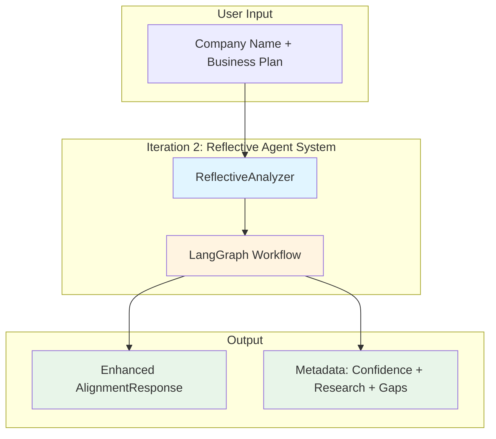

## 🔄 LangGraph Workflow

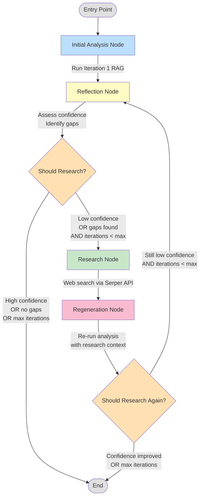

## 🎯 Agent Nodes Detailed

```mermaid
flowchart LR
    subgraph "Node 1: Initial Analysis"
        IA1[AlignmentAnalyzer<br/>Iteration 1 RAG]
        IA2[Retrieve VC Docs]
        IA3[Generate Initial<br/>Explanation]
        
        IA1 --> IA2
        IA2 --> IA3
    end
    
    subgraph "Node 2: Reflection"
        R1[For each claim:<br/>Assess Confidence]
        R2[Calculate<br/>Overall Confidence]
        R3[Identify<br/>Information Gaps]
        R4[Categorize Gaps]
        
        R1 --> R2
        R2 --> R3
        R3 --> R4
    end
    
    subgraph "Node 3: Research"
        RE1[Generate<br/>Search Queries]
        RE2[WebSearchTool<br/>Serper API]
        RE3[Parse Results]
        RE4[Format Snippets]
        
        RE1 --> RE2
        RE2 --> RE3
        RE3 --> RE4
    end
    
    subgraph "Node 4: Regeneration"
        RG1[Merge Research<br/>with RAG Docs]
        RG2[Re-run Analysis<br/>with Context]
        RG3[Update State]
        
        RG1 --> RG2
        RG2 --> RG3
    end
    
    IA3 --> R1
    R4 --> RE1
    RE4 --> RG1
    RG3 --> R1
    
    style IA1 fill:#e3f2fd
    style R1 fill:#fff9c4
    style RE1 fill:#c8e6c9
    style RG1 fill:#f8bbd0
```

## 🧠 Reflection Agent Components

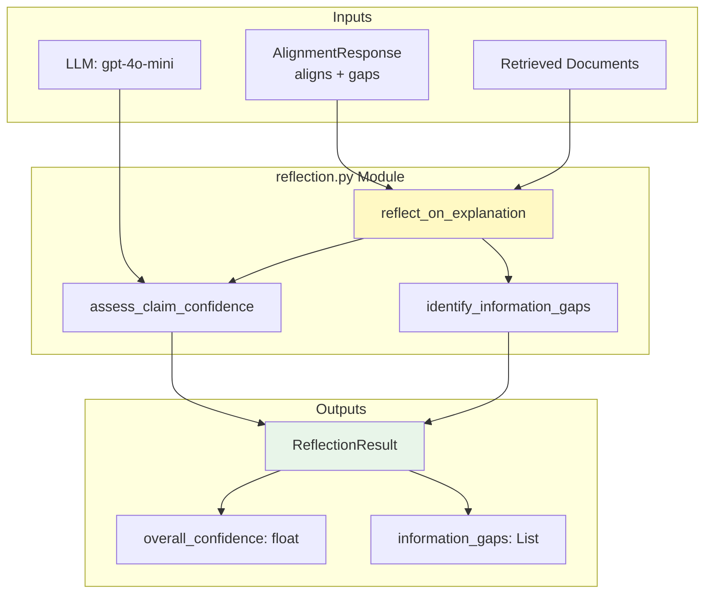

### Confidence Scoring

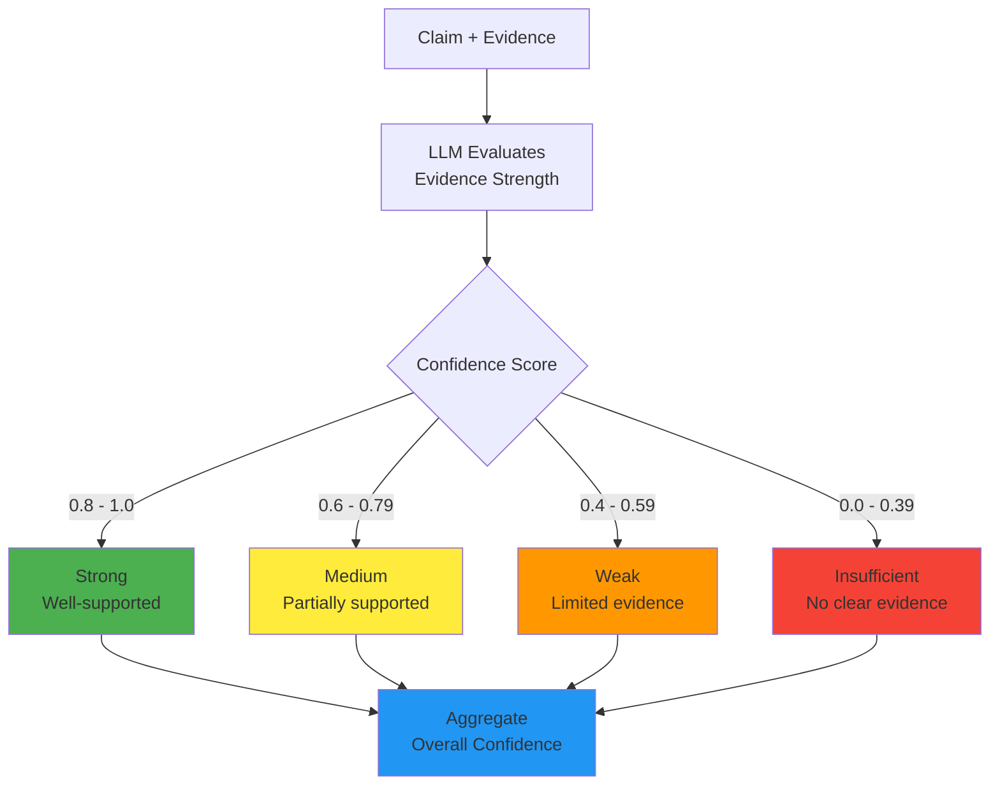

### Gap Identification

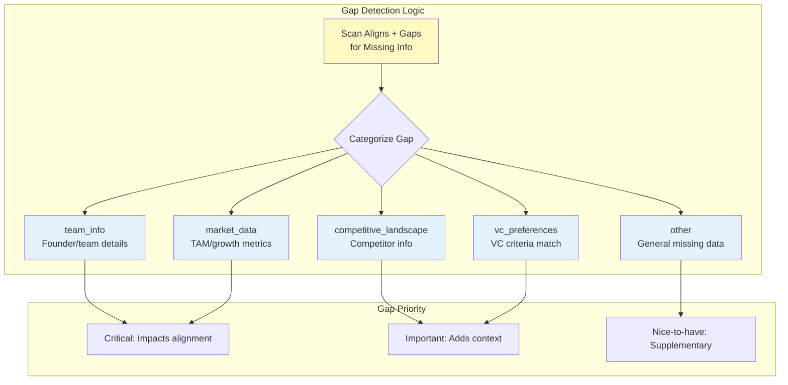

## 🔍 Research Agent Components

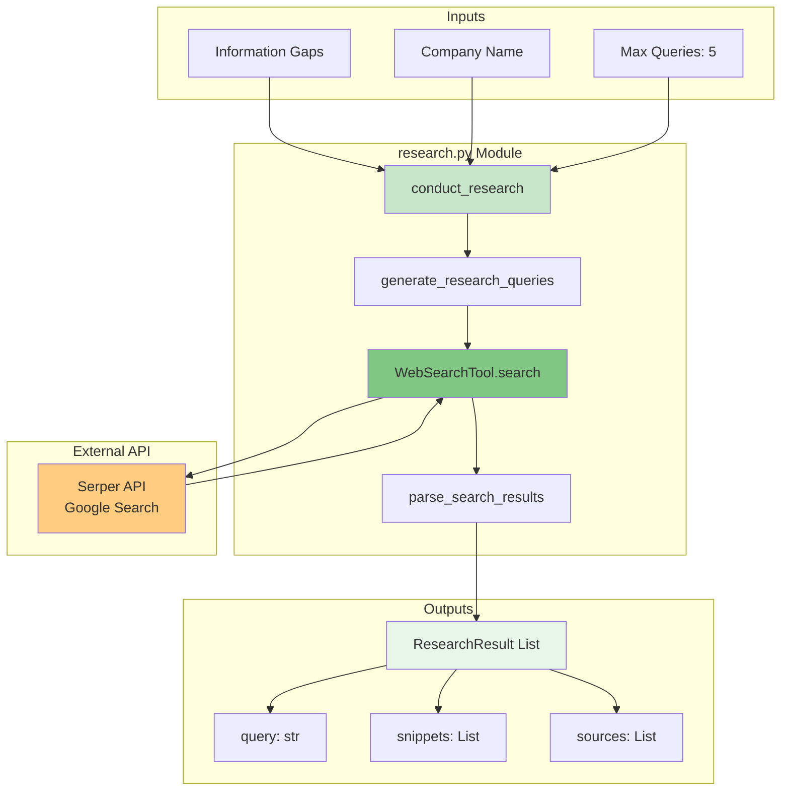

### Query Generation Strategy

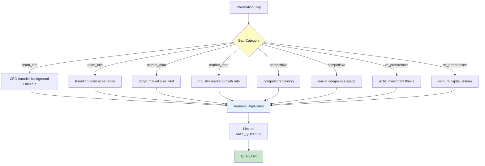

## 📊 State Management

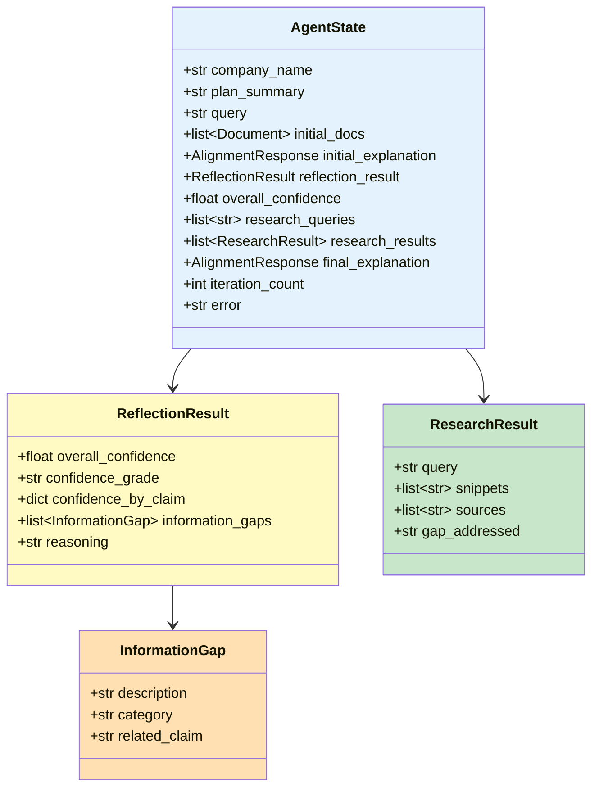

## 🔁 Iteration Loop

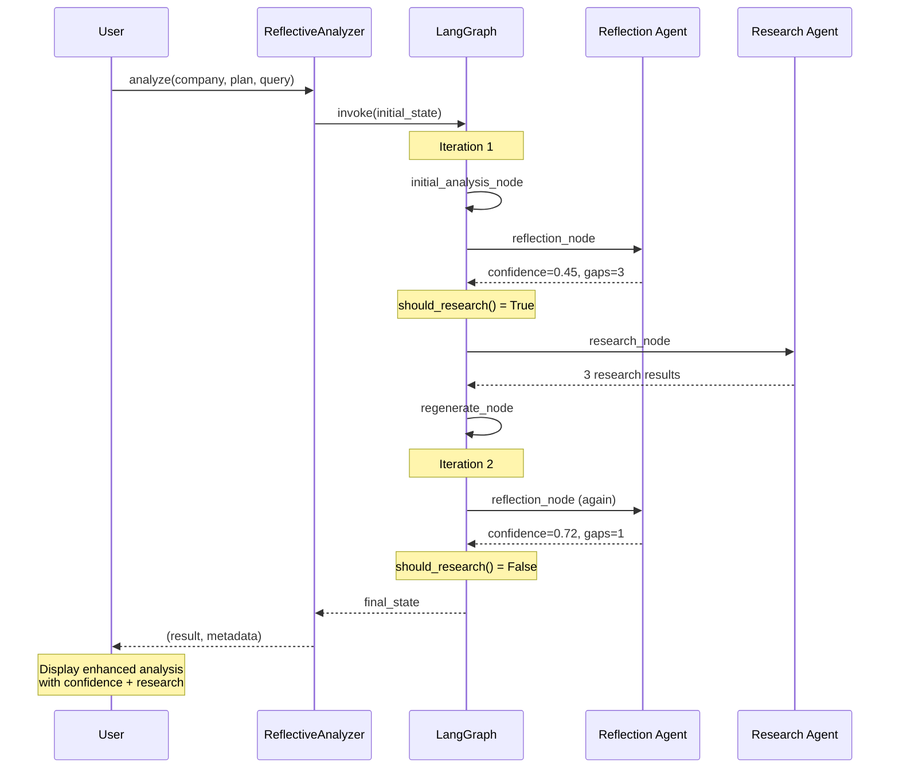

## 🎛️ Configuration

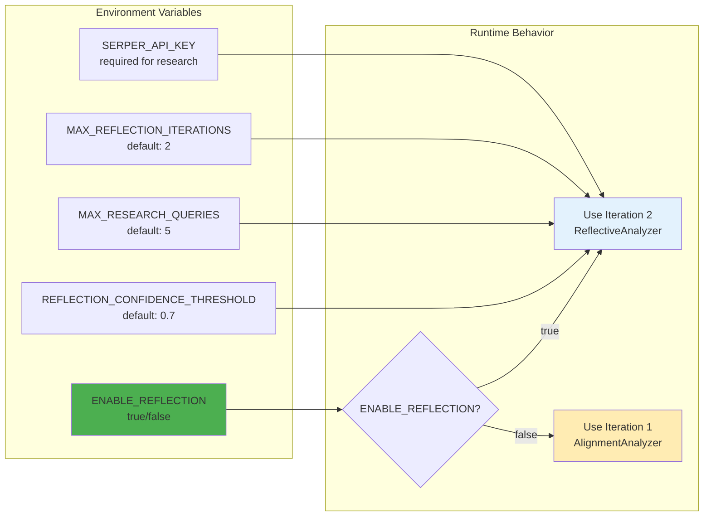

## 📈 Performance Characteristics

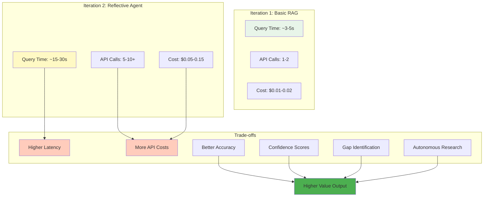

## 🔧 Implementation Files

| Component | File | Key Functions/Classes |
|-----------|------|----------------------|
| **Orchestration** | `src/vira/agents/graph.py` | `create_reflection_graph()`, `should_research()` |
| **State** | `src/vira/agents/state.py` | `AgentState`, `ReflectionResult`, `ResearchResult` |
| **Reflection** | `src/vira/agents/reflection.py` | `assess_claim_confidence()`, `identify_information_gaps()` |
| **Research** | `src/vira/agents/research.py` | `WebSearchTool`, `conduct_research()` |
| **Analyzer** | `src/vira/agents/analyzer.py` | `ReflectiveAnalyzer` |
| **API Integration** | `src/vira/backend/api.py` | `/analyze` endpoint (Iteration 2 mode) |
| **UI Integration** | `src/vira/backend/ui_routes.py` | `/api/sessions/{id}/analyze` |

## 🎯 Key Innovations

1. **Meta-Assessment**: Agent evaluates its own output quality
2. **Adaptive Retrieval**: Automatically identifies when more information is needed
3. **Autonomous Research**: Conducts external searches to fill gaps
4. **Confidence Quantification**: Provides numerical confidence scores
5. **Iterative Refinement**: Loops until confidence threshold met or max iterations
6. **Transparent Reasoning**: Shows research queries and gaps in UI

---

**See also:**
- `VIRA_MVP_Architecture_Plan_v0.md` (lines 527-730) - Original Iteration 2 spec
- `ITERATION2_IMPLEMENTATION_SUMMARY.md` - Implementation details
- `ITERATION2_QUICKSTART.md` - Usage guide

