# Iteration 3: Multi-Agent Investment Committee Architecture

This document visualizes the multi-agent architecture of VIRA's Iteration 3, which implements a full investment committee simulation with specialized agents, consensus synthesis, and proactive strategic recommendations.

## 🏗️ High-Level Architecture


## 🔄 Multi-Agent Workflow


## 🎯 Specialist Agent Details


## 🧠 Coordinator Agent Orchestration


## 📊 Shared Working Memory


## 🔍 Inter-Agent Communication

```mermaid
flowchart LR
    subgraph "Communication Patterns"
        A[Request Info]
        B[Share Finding]
        C[Ask Opinion]
        D[Verify Claim]
    end
    
    subgraph "Example Flow"
        M[Market Agent:<br/>"Found 3 competitors<br/>with patents"]
        
        M --> |Request| P[Product Agent:<br/>Check our patent status]
        
        P --> |Share| M[Product Agent:<br/>0 granted, 1 provisional]
        
        M --> |Ask| F[Financial Agent:<br/>Impact on valuation?]
        
        F --> |Verify| M[Financial Agent:<br/>IP moat worth 20-30%<br/>premium typically]
    end
    
    A --> M
    B --> P
    C --> F
    
    style M fill:#ffccbc
    style P fill:#c8e6c9
    style F fill:#fff9c4
```

## 🎭 Synthesis Agent Logic


### Consensus Algorithm

```mermaid
graph TB
    subgraph "Agreement Scoring"
        A["4/4 agents agree<br/>→ Strong Consensus ✓✓✓"]
        B["3/4 agents agree<br/>→ Majority View ✓✓"]
        C["2/2 split<br/>→ Requires Resolution ⚠"]
        D["No clear pattern<br/>→ Human Judgment Needed ?"]
    end
    
    subgraph "Conflict Resolution"
        E[Check evidence strength]
        F[Weight by agent confidence]
        G[Defer to domain expert agent]
        H[Flag for user decision]
    end
    
    C --> E
    C --> F
    C --> G
    D --> H
    
    style A fill:#4caf50
    style B fill:#8bc34a
    style C fill:#ff9800
    style D fill:#f44336
```



## 💡 Strategy Agent Components


### Positioning Strategy Flow


## 💬 Dialogue Agent Interface

```mermaid
sequenceDiagram
    participant U as User
    participant D as Dialogue Agent
    participant R as Router
    participant A as Specialist Agent
    participant M as Memory
    
    U->>D: "Why do you think the product is weak?"
    
    D->>R: Route query to relevant agent
    R->>R: Analyze question type
    
    Note over R: Product-related → Product Agent
    
    R->>A: Forward to Product Agent
    
    A->>M: Retrieve original assessment
    A->>A: Generate detailed explanation
    
    A-->>D: "The plan mentions AI but lacks:<br/>1. Architecture details<br/>2. Data moat explanation<br/>3. Competitive differentiation"
    
    D-->>U: Formatted response with context
    
    U->>D: "What would improve the score?"
    
    D->>A: Follow-up query
    A->>A: Generate recommendations
    
    A-->>D: "3 improvements:<br/>1. File provisional patent<br/>2. Show network effects timeline<br/>3. Demonstrate data advantage"
    
    D-->>U: Actionable recommendations
```



### Query Routing Logic


## 📈 Agent Research Workflows

### Market Agent Research Flow


### Team Agent Research Flow


## 🎯 Benchmark Comparison Engine


### Percentile Calculation

```mermaid
flowchart TD
    METRIC[Company Metric:<br/>e.g., Market Size] --> GATHER[Gather Portfolio<br/>Company Data]
    
    GATHER --> SORT[Sort in<br/>Ascending Order]
    
    SORT --> POSITION[Find Position<br/>of Target Company]
    
    POSITION --> CALC[Calculate:<br/>Percentile = Position/Total × 100]
    
    CALC --> INTERPRET{Interpret Result}
    
    INTERPRET --> |>75%| TOP[Top Quartile<br/>Strong Signal ✓✓✓]
    INTERPRET --> |50-75%| ABOVE[Above Average<br/>Positive Signal ✓✓]
    INTERPRET --> |25-50%| BELOW[Below Average<br/>Concern ⚠]
    INTERPRET --> |<25%| BOTTOM[Bottom Quartile<br/>Red Flag ✗]
    
    style CALC fill:#fff9c4
    style TOP fill:#4caf50
    style ABOVE fill:#8bc34a
    style BELOW fill:#ff9800
    style BOTTOM fill:#f44336
```



## 📊 Output Report Structure


## ⚙️ Configuration & Control


## 🔧 Implementation Files

| Component | File | Key Functions/Classes |
|-----------|------|----------------------|
| **Orchestration** | `src/vira/agents/committee/coordinator.py` | `CoordinatorAgent`, `dispatch_parallel()` |
| **Specialist Agents** | `src/vira/agents/committee/specialists.py` | `MarketAgent`, `ProductAgent`, `TeamAgent`, `FinancialAgent` |
| **Shared Memory** | `src/vira/agents/committee/memory.py` | `SharedMemory`, `store_finding()`, `retrieve_context()` |
| **Synthesis** | `src/vira/agents/committee/synthesis.py` | `SynthesisAgent`, `identify_consensus()`, `resolve_conflicts()` |
| **Strategy** | `src/vira/agents/committee/strategy.py` | `StrategyAgent`, `generate_positioning()`, `benchmark_analysis()` |
| **Dialogue** | `src/vira/agents/committee/dialogue.py` | `DialogueAgent`, `route_query()`, `interactive_qa()` |
| **State** | `src/vira/agents/committee/state.py` | `CommitteeState`, `AgentAssessment`, `SynthesisResult` |
| **API Integration** | `src/vira/backend/api.py` | `/analyze` endpoint (Iteration 3 mode) |

## 📈 Performance Characteristics


## 🎯 Key Innovations

1. **Parallel Agent Execution**: 4 agents work simultaneously (20-30s vs 60-80s sequential)
2. **Shared Working Memory**: Cross-agent communication and context sharing
3. **Consensus Synthesis**: Automatic identification of agreement vs. disagreement
4. **Multi-Perspective Analysis**: Investment committee simulation with specialist views
5. **Strategic Positioning**: Actionable recommendations for both startups and VCs
6. **Benchmark Engine**: Percentile ranking vs. portfolio and market comparables
7. **Interactive Dialogue**: Q&A with individual agents for deeper exploration
8. **Adaptive Research**: Agents autonomously decide research depth based on confidence

## 🆚 Iteration Comparison


---

**See also:**
- `Iter1RAG.md` - Iteration 1 RAG architecture diagrams
- `Iter2Agents.md` - Iteration 2 reflective agent diagrams
- `VIRA_MVP_Architecture_Plan_v0.md` (lines 733-1116) - Original Iteration 3 spec


