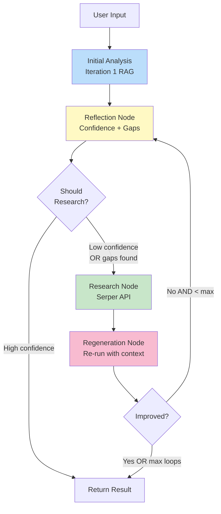
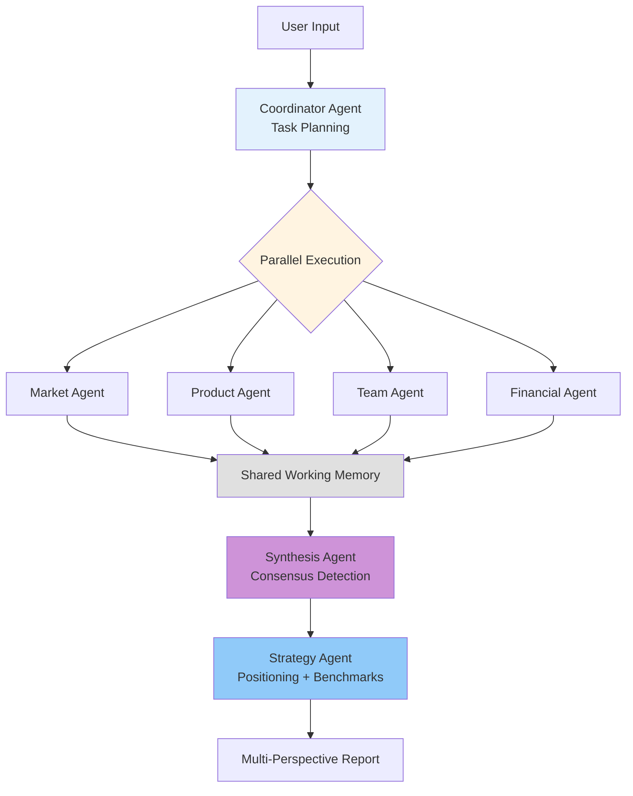

# VIRA Architecture vs LangGraph Pattern Repositories

This document compares VIRA's agentic architecture (Iterations 2 & 3) with two influential LangGraph pattern repositories: **deep_research_from_scratch** and **deep-agents-from-scratch**.

## Executive Summary

**VIRA Iteration 2 (Reflective Agent)** implements a **simplified linear workflow** that shares foundational LangGraph patterns with both repositories but differs in orchestration approach. It's most similar to a **single-pass version of deep_research** without the supervisor-worker hierarchy.

**VIRA Iteration 3 (Multi-Agent Committee)** closely mirrors **deep_research_from_scratch's supervisor-worker pattern**, with parallel specialist agents coordinated by a central orchestrator. However, VIRA adds unique consensus synthesis, strategy generation, and benchmark comparison capabilities.

---

## 🔄 VIRA Iteration 2: Reflective Agent

### Architectural Pattern Classification

**Pattern Type**: **Linear Reflection Loop with Adaptive Research**



### Comparison Table: Iteration 2 vs Pattern Repositories

| Aspect | VIRA Iteration 2 | deep_research_from_scratch | deep-agents-from-scratch |
|--------|-----------------|---------------------------|-------------------------|
| **Orchestration** | Linear workflow with conditional branching | Multi-phase with supervisor-worker | Single agent with middleware |
| **Agent Model** | Single reflective agent | Supervisor + multiple workers | Single autonomous agent + delegation |
| **Parallelization** | ❌ Sequential execution | ✅ Parallel workers via `asyncio.gather()` | ❌ Sequential by default |
| **Planning** | ❌ No explicit planning phase | ✅ Upfront scoping phase | ✅ Continuous TODO tool |
| **Context Management** | Prompt compression, snippet pruning | Brief compression, result pruning | File system offloading, auto-summarization |
| **State Persistence** | Transient per-query | Transient per-research session | ✅ Persistent file system |
| **Research Trigger** | Confidence threshold + gap detection | Supervisor decision | Agent self-determination |
| **Iteration Control** | Max 2 loops, confidence threshold | Supervisor reflection on completeness | TODO status tracking |
| **Tool Integration** | Serper API (web search) | Tavily, MCP servers | Built-in file system + custom tools |
| **Modularity** | Functional nodes in graph | Subgraph composition | Middleware composition |
| **Best For** | Single query analysis with gap-filling | Parallelizable multi-topic research | Long-horizon sequential tasks |

### What VIRA Iteration 2 Shares

#### ✅ **1. LangGraph StateGraph Foundation**

All three use LangGraph's `StateGraph` for deterministic workflow orchestration:

```python
# VIRA Iteration 2 (from src/vira/agents/graph.py)
from langgraph.graph import StateGraph
from vira.agents.state import AgentState

workflow = StateGraph(AgentState)
workflow.add_node("initial_analysis", initial_analysis_node)
workflow.add_node("reflection", reflection_node)
workflow.add_node("research", research_node)
workflow.add_node("regeneration", regeneration_node)

workflow.add_conditional_edges(
    "reflection",
    should_research,
    {True: "research", False: END}
)
```

This matches both repositories' use of LangGraph for explicit state management and flow control.

#### ✅ **2. ReAct Pattern for Tool Calling**

VIRA's research node implements ReAct-style reasoning + action:

```python
# VIRA's Research Node (simplified)
def research_node(state: AgentState) -> AgentState:
    """Conduct web research to fill information gaps."""
    
    # REASON: Identify what to search for
    gaps = state["reflection_result"].information_gaps
    queries = generate_research_queries(gaps, state["company_name"])
    
    # ACT: Execute searches
    results = []
    for query in queries:
        search_results = web_search_tool.search(query, num_results=5)
        results.append(search_results)
    
    # Update state
    state["research_queries"] = queries
    state["research_results"] = results
    return state
```

Both pattern repositories use similar ReAct loops, though deep_research uses it within worker agents and deep-agents uses it as the primary agent loop.

#### ✅ **3. Structured Output with Pydantic**

All three use Pydantic schemas to constrain LLM outputs:

```python
# VIRA's Reflection Result
class ReflectionResult(BaseModel):
    overall_confidence: float
    confidence_grade: str
    confidence_by_claim: dict[str, float]
    information_gaps: list[InformationGap]
    reasoning: str

class InformationGap(BaseModel):
    description: str
    category: str  # team_info, market_data, competitive_landscape, etc.
    related_claim: str
```

Similar to:
- **deep_research**: `ClarifyWithUser`, `ResearchQuestion`, `ConductResearch`
- **deep-agents**: `TodoItem`, task status tracking

#### ✅ **4. Confidence/Quality Assessment**

VIRA's reflection node assesses output quality, similar to:
- **deep_research**: Supervisor reflection on whether findings address the brief
- **deep-agents**: TODO status tracking ensures task completion

```python
# VIRA's Confidence Assessment
def assess_claim_confidence(claim: str, evidence: list[Document], llm) -> float:
    """Rate confidence 0.0-1.0 based on evidence strength."""
    # Structured prompt for LLM evaluation
    # Returns: 1.0 (explicit), 0.7 (supporting), 0.4 (weak), 0.0 (none)
```

However, VIRA's **numerical confidence scoring** is unique—neither repository implements explicit confidence quantification.

#### ✅ **5. Iterative Refinement**

All three loop until a quality threshold is met:

- **VIRA**: Loops until confidence > 0.7 OR max 2 iterations
- **deep_research**: Supervisor reflects and spawns more workers if gaps exist
- **deep-agents**: Agent updates TODO status and continues until all tasks complete

### What VIRA Iteration 2 Does NOT Have

#### ❌ **1. File System Backend (deep-agents pattern)**

VIRA does not use a virtual file system for persistent memory across conversation turns. State is transient and scoped to a single query.

**deep-agents pattern:**
```python
class AgentState(TypedDict):
    messages: list
    todos: List[TodoItem]
    files: Dict[str, str]  # Virtual file system ← VIRA doesn't have this
```

**Why VIRA doesn't need it**: Each analysis is a self-contained query, not a long-horizon task requiring persistent memory.

#### ❌ **2. TODO Planning Tool (deep-agents pattern)**

VIRA does not use explicit TODO planning for task management.

**deep-agents pattern:**
```python
write_todos([
    {"task": "Search for X", "status": "pending"},
    {"task": "Analyze findings", "status": "in_progress"}
])
```

**Why VIRA doesn't need it**: The workflow is pre-defined (Initial → Reflect → Research → Regenerate), not emergent.

#### ❌ **3. Supervisor-Worker Hierarchy (deep_research pattern)**

VIRA Iteration 2 is a **single agent with sequential nodes**, not multiple workers coordinated by a supervisor.

**deep_research pattern:**
```
Supervisor
├── Worker 1 (Topic A)
├── Worker 2 (Topic B)
└── Worker 3 (Topic C)
```

**Why VIRA doesn't use it yet**: Iteration 2 focuses on a single analytical perspective. **Iteration 3 will introduce this pattern** (see below).

#### ❌ **4. Parallel Execution**

VIRA Iteration 2 executes sequentially: Initial → Reflect → Research → Regenerate.

**deep_research** parallelizes workers with `asyncio.gather()`, which is faster for independent research topics.

**Why VIRA doesn't parallelize**: Each step depends on the previous (can't reflect before initial analysis, can't regenerate before research).

#### ❌ **5. Automatic Context Offloading**

VIRA does not automatically save large tool results to files when context exceeds thresholds (a deep-agents feature).

**deep-agents pattern:**
```python
# Automatically save tool results > 20K tokens to files
if len(result) > 20000:
    save_to_file(f"result_{timestamp}.txt", result)
    return f"Result saved to result_{timestamp}.txt"
```

**Why VIRA doesn't need it**: Research results are already structured as snippets (not full documents), keeping context manageable.

---

## 🎭 VIRA Iteration 3: Multi-Agent Investment Committee

### Architectural Pattern Classification

**Pattern Type**: **Supervisor-Worker with Consensus Synthesis + Strategy**

**This closely mirrors `deep_research_from_scratch`'s supervisor-worker pattern**, with significant enhancements.



### Comparison Table: Iteration 3 vs Pattern Repositories

| Aspect | VIRA Iteration 3 (Planned) | deep_research_from_scratch | deep-agents-from-scratch |
|--------|---------------------------|---------------------------|-------------------------|
| **Orchestration** | Coordinator + 4 specialists | Supervisor + N workers | Single agent + delegation |
| **Agent Roles** | ✅ Fixed roles (Market, Product, Team, Financial) | ✅ Dynamic workers per topic | ⚠️ No fixed roles |
| **Parallelization** | ✅ `asyncio.gather()` for 4 agents | ✅ `asyncio.gather()` for workers | ❌ Sequential |
| **Shared Memory** | ✅ Vector + KV store for cross-agent context | ❌ Workers isolated | ✅ File system shared state |
| **Consensus Synthesis** | ✅ Explicit synthesis agent (3/4 agreement) | ⚠️ Supervisor aggregation (no voting) | ❌ No consensus logic |
| **Inter-Agent Communication** | ✅ Agents can message each other | ❌ Workers don't communicate | ⚠️ Sub-agents isolated |
| **Strategy Generation** | ✅ Dedicated strategy agent | ❌ No strategy component | ❌ No strategy component |
| **Benchmark Comparisons** | ✅ Percentile ranking vs portfolio | ❌ No benchmarking | ❌ No benchmarking |
| **Interactive Q&A** | ✅ Dialogue agent routes to specialists | ❌ No Q&A interface | ❌ No Q&A interface |
| **Best For** | Investment committee simulation | Multi-topic research reports | Long sequential coding tasks |

### What VIRA Iteration 3 Shares with deep_research_from_scratch

#### ✅ **1. Supervisor-Worker Architecture**

Both use a coordinator/supervisor that dispatches work to specialized agents:

**VIRA Iteration 3 (planned):**
```python
class CoordinatorAgent:
    def __init__(self):
        self.specialists = {
            "market": MarketAgent(),
            "product": ProductAgent(),
            "team": TeamAgent(),
            "financial": FinancialAgent()
        }
    
    async def dispatch_parallel(self, plan: str, criteria: str):
        """Run all specialists in parallel."""
        tasks = [agent.analyze(plan, criteria) 
                 for agent in self.specialists.values()]
        return await asyncio.gather(*tasks)
```

**deep_research_from_scratch pattern:**
```python
# Supervisor decides how many workers and what topics
supervisor_decision = decide_research_topics(brief)
workers = [create_worker(topic) for topic in supervisor_decision.topics]
results = await asyncio.gather(*[worker.research() for worker in workers])
```

Both patterns enable **parallel execution** of independent work, significantly reducing latency.

#### ✅ **2. Parallel Execution with asyncio.gather()**

Both orchestrators leverage Python's `asyncio.gather()` for concurrent agent execution:

- **VIRA**: 4 specialist agents run simultaneously (~20-30s total vs 60-80s sequential)
- **deep_research**: N workers research different topics simultaneously

#### ✅ **3. Upfront Task Planning**

Both have an initial planning phase where the coordinator/supervisor decides how to decompose work:

- **VIRA**: Coordinator analyzes business plan complexity and assigns research budgets per agent
- **deep_research**: Scoping phase generates a research brief, supervisor decomposes into sub-topics

#### ✅ **4. LangGraph Orchestration**

Both use LangGraph for workflow management, though VIRA Iteration 3 will likely use a more complex graph structure.

### What VIRA Iteration 3 Adds (Unique Features)

#### ⭐ **1. Shared Working Memory for Cross-Agent Communication**

**VIRA's innovation**: Agents can read each other's findings and send messages, enabling collaborative intelligence.

```python
# VIRA's Shared Memory Architecture
class SharedMemory:
    def __init__(self):
        self.vector_memory = ChromaDB()  # Semantic search across findings
        self.kv_store = {}  # Structured data
        self.agent_notes = []  # Inter-agent messages
        self.research_cache = {}  # Avoid redundant searches
    
    def store_finding(self, agent_name: str, finding: dict):
        """Store and index a finding."""
        self.vector_memory.add(finding)
        self.kv_store[f"{agent_name}_{finding['id']}"] = finding
    
    def retrieve_context(self, query: str, requesting_agent: str):
        """Retrieve relevant context from other agents."""
        return self.vector_memory.query(query, exclude_agent=requesting_agent)
```

**Example inter-agent communication:**
```
Market Agent: "Found 3 competitors with patents filed"
    ↓ (writes to shared memory)
Product Agent: (reads shared memory) "Checked - our startup has 0 granted, 1 provisional"
    ↓ (writes to shared memory)
Financial Agent: (reads shared memory) "IP moat typically worth 20-30% valuation premium"
```

**Neither pattern repository has this**: 
- **deep_research**: Workers are isolated, only supervisor sees all results
- **deep-agents**: File system is shared, but no explicit cross-agent messaging

#### ⭐ **2. Consensus Synthesis Algorithm**

**VIRA's innovation**: Explicit consensus detection based on agent agreement levels.

```python
def identify_consensus(assessments: list[AgentAssessment]) -> list[ConsensusItem]:
    """Find claims where 3+ agents agree."""
    findings_by_topic = group_by_topic(assessments)
    consensus = []
    
    for topic, findings in findings_by_topic.items():
        agreement_count = count_agreement(findings)
        if agreement_count >= 3:  # 3/4 or 4/4 agents agree
            consensus.append(ConsensusItem(
                topic=topic,
                agreement_level=agreement_count,
                supporting_agents=[...],
                evidence=[...]
            ))
    
    return consensus
```

**Consensus grades:**
- **4/4 agents agree** → Strong Consensus ✓✓✓
- **3/4 agents agree** → Majority View ✓✓
- **2/2 split** → Requires Resolution ⚠
- **No pattern** → Human Judgment Needed ?

**Neither pattern repository has this**: They aggregate results but don't vote or identify consensus.

#### ⭐ **3. Strategy Agent with Positioning Recommendations**

**VIRA's innovation**: Dedicated agent that generates actionable strategy for both startups and VCs.

```python
class StrategyAgent:
    """Generate positioning strategy based on synthesis."""
    
    def generate_positioning(self, synthesis: SynthesisResult) -> PositioningStrategy:
        """
        Returns:
            - Strengths to emphasize (for startup)
            - Gaps to address (with mitigation tactics)
            - Target partner match (which VC partner fits best)
            - Comparable positioning (vs portfolio companies)
        """
        # Identify top 3 strengths
        strengths = prioritize_strengths(synthesis.consensus_strengths)
        
        # Identify top 3 gaps with mitigation tactics
        gaps = prioritize_gaps(synthesis.disagreement_areas)
        
        # Match to VC portfolio
        target_partner = match_to_portfolio(strengths, self.vc_portfolio_data)
        
        # Benchmark analysis
        benchmarks = calculate_percentiles(synthesis, self.comparable_companies)
        
        return PositioningStrategy(
            startup_tactics=generate_tactics(strengths, gaps),
            vc_fit_analysis=analyze_fit(target_partner),
            benchmarks=benchmarks,
            target_partner=target_partner.name
        )
```

**Neither pattern repository has this**: They focus on research and reporting, not strategic recommendations.

#### ⭐ **4. Benchmark Comparison Engine**

**VIRA's innovation**: Percentile ranking against VC portfolio and market comparables.

```python
def calculate_percentiles(company_metrics: dict, comparables: list[Company]) -> BenchmarkData:
    """
    Calculate percentile rankings:
    - >75%: Top Quartile ✓✓✓
    - 50-75%: Above Average ✓✓
    - 25-50%: Below Average ⚠
    - <25%: Bottom Quartile ✗
    """
    percentiles = {}
    
    for metric in ["market_size", "team_experience", "capital_efficiency", "tech_moat"]:
        values = [c.metrics[metric] for c in comparables]
        values.append(company_metrics[metric])
        values.sort()
        
        position = values.index(company_metrics[metric])
        percentiles[metric] = (position / len(values)) * 100
    
    return BenchmarkData(
        percentiles=percentiles,
        closest_comparable=find_closest(company_metrics, comparables),
        portfolio_matches=find_matches(company_metrics, comparables)
    )
```

**Neither pattern repository has this**: No quantitative benchmarking capabilities.

#### ⭐ **5. Interactive Dialogue Agent**

**VIRA's innovation**: Q&A interface that routes follow-up questions to the appropriate specialist agent.

```python
class DialogueAgent:
    """Route user questions to the right specialist agent."""
    
    def route_query(self, user_question: str) -> str:
        """
        Classify question type and route to appropriate agent:
        - "Why is the product weak?" → Product Agent
        - "How's the market timing?" → Market Agent
        - "What about the founders?" → Team Agent
        """
        question_type = classify_question(user_question)
        target_agent = self.specialists[question_type]
        
        # Agent retrieves its original assessment from shared memory
        original_assessment = self.shared_memory.retrieve(target_agent.name)
        
        # Agent generates detailed explanation
        response = target_agent.explain(user_question, original_assessment)
        
        return response
```

**Neither pattern repository has this**: No interactive Q&A interface.

### What VIRA Iteration 3 Does NOT Have

#### ❌ **1. File System Backend (deep-agents pattern)**

Like Iteration 2, VIRA Iteration 3 does not use a virtual file system for persistent memory. Shared memory is scoped to the current analysis session.

#### ❌ **2. TODO Planning (deep-agents pattern)**

VIRA uses upfront task planning (coordinator decides agent assignments), not continuous TODO tracking.

#### ❌ **3. Dynamic Worker Spawning (deep_research pattern)**

VIRA has **fixed 4 specialist agents**, whereas deep_research can spawn variable numbers of workers based on topic complexity.

**Trade-off**: Fixed roles ensure consistent coverage of investment criteria, but less flexibility for unusual business plans.

---

## 🆚 Side-by-Side Comparison Matrix

### Iteration 2 vs Both Patterns

| Feature | VIRA Iter 2 | deep_research | deep-agents |
|---------|-------------|---------------|-------------|
| **LangGraph** | ✅ | ✅ | ✅ |
| **ReAct Pattern** | ✅ | ✅ | ✅ |
| **Pydantic Schemas** | ✅ | ✅ | ✅ |
| **Confidence Scoring** | ✅ (unique) | ❌ | ❌ |
| **Gap Identification** | ✅ | ⚠️ (implicit) | ❌ |
| **Supervisor-Worker** | ❌ | ✅ | ❌ |
| **TODO Planning** | ❌ | ❌ | ✅ |
| **File System** | ❌ | ❌ | ✅ |
| **Parallel Execution** | ❌ | ✅ | ❌ |
| **Iteration Loop** | ✅ (max 2) | ✅ (supervisor reflection) | ✅ (TODO status) |

### Iteration 3 vs Both Patterns

| Feature | VIRA Iter 3 (Planned) | deep_research | deep-agents |
|---------|----------------------|---------------|-------------|
| **Supervisor-Worker** | ✅ | ✅ | ❌ |
| **Parallel Execution** | ✅ | ✅ | ❌ |
| **Fixed Agent Roles** | ✅ (4 specialists) | ❌ (dynamic) | ❌ |
| **Shared Memory** | ✅ (unique) | ❌ | ⚠️ (file system) |
| **Inter-Agent Messaging** | ✅ (unique) | ❌ | ❌ |
| **Consensus Synthesis** | ✅ (unique) | ❌ | ❌ |
| **Strategy Generation** | ✅ (unique) | ❌ | ❌ |
| **Benchmark Engine** | ✅ (unique) | ❌ | ❌ |
| **Interactive Q&A** | ✅ (unique) | ❌ | ❌ |
| **File System** | ❌ | ❌ | ✅ |
| **TODO Planning** | ❌ | ❌ | ✅ |

Legend:
- ✅ Has feature
- ❌ Does not have feature
- ⚠️ Partial/related feature

---

## 📊 Pattern Matching Summary

### VIRA Iteration 2: Closest Match

**Closest to**: **Simplified version of deep_research_from_scratch** (single worker, no supervisor)

**Pattern classification**: **Linear Reflection Loop**

**Key differentiators**:
- Explicit confidence scoring (unique to VIRA)
- Gap identification and targeted research (more structured than both)
- Simpler workflow (4 nodes vs complex subgraphs)

**Would benefit from**:
- ❌ Parallel research for multiple gaps (deep_research pattern)
- ❌ File system for multi-turn conversations (deep-agents pattern)

### VIRA Iteration 3: Closest Match

**Closest to**: **deep_research_from_scratch's supervisor-worker pattern**

**Pattern classification**: **Supervisor-Worker with Consensus Synthesis**

**Key differentiators**:
- Fixed specialist roles (Market, Product, Team, Financial)
- Shared memory for cross-agent communication (unique)
- Consensus synthesis algorithm (unique)
- Strategy agent with positioning recommendations (unique)
- Benchmark comparison engine (unique)
- Interactive dialogue interface (unique)

**Borrows from deep_research**:
- ✅ Coordinator/supervisor orchestration
- ✅ Parallel agent execution with `asyncio.gather()`
- ✅ Upfront task planning

**Does NOT borrow from deep-agents**:
- ❌ File system backend
- ❌ TODO planning tool
- ❌ Middleware composition

---

## 🎯 Recommendations for VIRA

### For Iteration 2 (Currently Implemented)

**Consider adopting from deep-agents**:

1. **File System Backend** for multi-turn conversations:
   ```python
   # Enable context persistence across questions
   class SessionMemory:
       def __init__(self, session_id: str):
           self.files = {}  # Virtual file system per session
       
       def store_analysis(self, result: AlignmentResponse):
           """Save analysis to file for later reference."""
           self.files[f"analysis_{timestamp}.json"] = result.json()
   ```

2. **Automatic context offloading** for very long business plans:
   ```python
   # If plan > 50K tokens, save to file and work with summary
   if len(plan_summary) > 50000:
       save_to_file(f"plan_{session_id}.txt", plan_summary)
       plan_summary = summarize(plan_summary, max_tokens=5000)
   ```

**Consider adopting from deep_research**:

3. **Parallel gap research** when multiple unrelated gaps identified:
   ```python
   # Instead of sequential research for 5 gaps, parallelize:
   async def research_all_gaps(gaps: list[InformationGap]):
       tasks = [research_gap(gap) for gap in gaps]
       return await asyncio.gather(*tasks)
   ```

### For Iteration 3 (Planned Implementation)

**Already adopting best patterns**:
- ✅ Supervisor-worker from deep_research
- ✅ Parallel execution from deep_research
- ✅ Upfront planning from deep_research

**Consider hybrid approach**:

4. **Combine supervisor pattern with file system** (best of both):
   ```python
   # Give each specialist agent a file system backend
   class SpecialistAgent:
       def __init__(self, role: str, shared_memory: SharedMemory):
           self.role = role
           self.shared_memory = shared_memory
           self.local_files = {}  # File system for complex analysis
       
       async def analyze(self, plan: str):
           # Can save intermediate research to files
           # Can share high-level findings via shared memory
           # Gets context management + cross-agent communication
   ```

5. **Add TODO tracking for each specialist agent** (from deep-agents):
   ```python
   # Each agent maintains a task list for transparency
   market_agent_todos = [
       {"task": "Research TAM", "status": "completed"},
       {"task": "Analyze competitors", "status": "in_progress"},
       {"task": "Assess timing", "status": "pending"}
   ]
   ```

This would provide visibility into each agent's progress during the 20-30s parallel execution phase.

---

## 📚 Key Takeaways

1. **VIRA Iteration 2** is a **simplified, domain-specific variant** of deep_research's pattern—linear workflow vs multi-phase, single agent vs supervisor-worker. It adds unique confidence scoring and structured gap identification.

2. **VIRA Iteration 3** **strongly resembles deep_research's supervisor-worker pattern** but adds significant innovations for investment committee simulation: consensus synthesis, strategy generation, benchmarking, and interactive Q&A.

3. **VIRA does NOT use** deep-agents' file system backend or TODO planning, which are optimized for long-horizon sequential tasks (50+ tool calls). VIRA's tasks are shorter and more structured.

4. **Best hybrid approach for VIRA**: Adopt parallel execution from deep_research (already planned for Iter 3) + add file system backend from deep-agents for multi-turn sessions (future enhancement).

5. **VIRA's unique contributions**: Confidence scoring, consensus synthesis, strategy generation, and benchmark comparisons—none of which exist in either pattern repository.

---

## 📖 References

- **VIRA Documentation**:
  - `docs/02-ARCHITECTURE/03-Agent-Architecture.md` - Iteration 2 details
  - `docs/02-ARCHITECTURE/04-Multi-Agent-Architecture.md` - Iteration 3 design
  - `src/vira/agents/analyzer.py` - Iteration 2 implementation
  - `src/vira/agents/graph.py` - LangGraph workflow

- **Pattern Repositories**:
  - `deep_research_from_scratch` - Multi-phase research workflow
  - `deep-agents-from-scratch` - Long-horizon task agents with context engineering

- **Key Concepts**:
  - LangGraph StateGraph orchestration
  - ReAct (Reason-Act) pattern for tool calling
  - Supervisor-worker architecture for parallel agents
  - File system backend for persistent memory
  - TODO planning for task management

